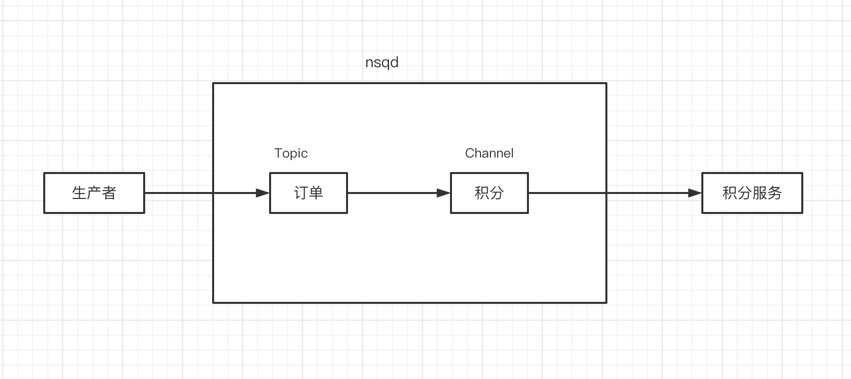
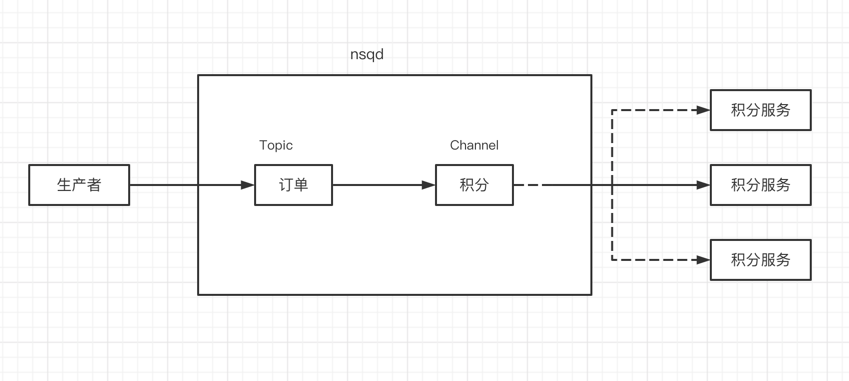
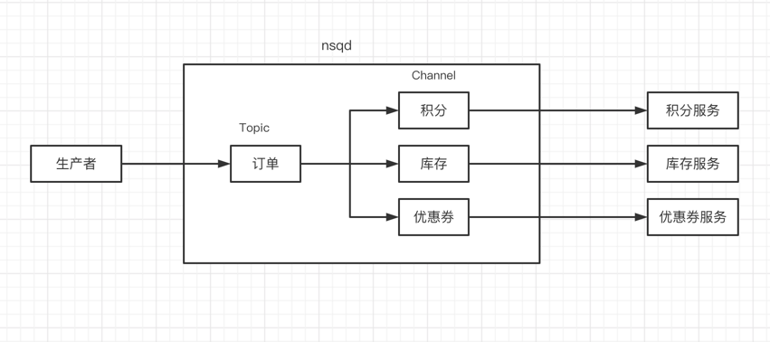
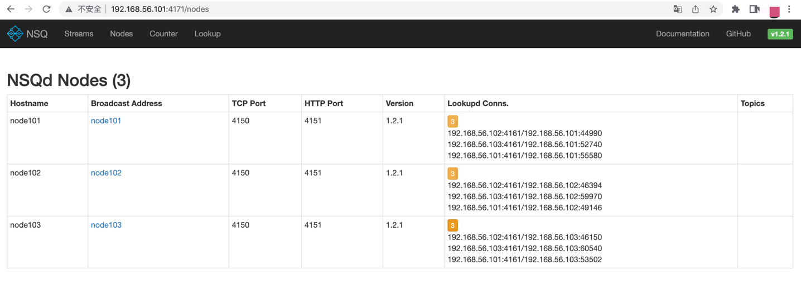

NSQ 实时分布式消息平台

### 为什么要读源码
读源码是每个程序员进阶的必修课，阅读优秀开源框架的源码，可以提升编程技能，学习到优秀的设计模式，从而形成自己的编程风格。

我们看到的八股文都是大牛们看源码以后，用文字的形式表述出来的，有时候我们看了八股文，虽然当时记住了，但是过段时间又会忘记了，没有自己去看源码印象深刻。

阅读源码可能不像学习框架的使用来的那么直接，有时候甚至很枯燥，坚持看下去，源码面前毫无秘密，读源码会有一种豁然开朗的感觉。

### 怎么读源码
- 先学会用，读官网文档，读技术文章
- 环境搭建，源码启动
- 核心思想，代码结构
- 核心模块，增删改查
- 先整体再细节，逐个击破

### 为什么要选择读 NSQ 源码
已经学习了 Go 语言基础，但是不知道怎么去使用，那么可以去看看一些开源框架里面都是怎么去使用这些技术点的，不仅仅学习技术点，还可以学习一些框架的设计，这样对我们开发水平的提高是有非常大的帮助的。

- NSQ 使用 Go 语言开发
- NSQ 涉及到的 Go 技术点
  - slice、map、struct、interface、error
  - goroutine、channel、select
  - lock
  - 网络编程 tcp、http
  - 自定义数据报文、编解码
  - 等等

### 简单介绍
官网地址 [https://nsq.io](https://nsq.io)

主要特性
- 分布式：去中心化，无单点故障；
- 可伸缩：支持水平扩展，没有中心化的 broker，支持pub-sub，load-balanced 的消息传递；
- 运维友好：非常容易配置和部署，内置 admin UI；
- 集成方便：目前主流语言都有相应的[客户端支持](https://nsq.io/clients/client_libraries.html) 。

### 一些概念
- Topic 主题，存储生产者发送过来的数据
- Channel 通道，这里的 channel 不是指 Go 语言中的 channel，而是 nsqd 内部的数据结构。

生产者将数据发送给 Topic，消费者消费 Topic 中的数据需要指定 Topic 和 Channel 的名称，Channel 名称可以指定也可以不指定，如果不自定则会生成一个临时的 Channel。



假如有一个购物平台，用户下单购物送积分，订单服务作为生产者将订单消息发送给 `nsqd` 的订单 topic，`nsqd` 将订单 Topic 中的订单信息发送给积分 Channel，积分服务消费订单数据，给用户加积分。
生产者只负责把数据发送给某个 Topic，生产者不用管有哪些消费者。消费者想要消费数据需要指定 Topic 和  Channel，这里的 Channel 是消费者指定的。



积分服务一般都会部署多个节点，比如这里部署了3个节点，3个积分服务实例都消费同一个 Topic/Channel （订单/积分）中的数据，那么 `nsqd` 只会把积分 Channel 中的订单信息发送给其中一个节点。



用户下单还会涉及到库存和优惠券服务，那么同样的库存服务和优惠券服务也需要消费订单 Topic 的数据，那么他们分别指定 Topic/Channel 为 订单/库存 和 订单/优惠券 就可以了， 
`nsqd` 负责将订单 Topic 中的数据发送给 3 个 Channel（积分、库存、优惠券）。


### 核心组件
- nsqd
  - 负责接收、排队、转发消息到客户端的守护进程，可以单独运行
  - 监听 4150（TCP）、4151（HTTP）、4152（HTTPS，可选）端口
- nsqlookupd
  - 管理拓扑信息
  - 不需要和其他 `nsqlookupd` 协调提供查询
  - `nsqd` 向 `nsqlookupd` 广播 topic 和 channel 信息
  - 客户端查询 `nsqlookupd` 发现指定 topic 的 `nsqd` 生产者
  - 监听 4160（TCP） 和 4161（HTTP）端口；
- nsqadmin 
  提供一个 web ui, 用于实时查看集群信息，进行各种任务管理。
  
- utilities
  nsq 也提供了一些工具供我们使用
  - nsq_stat 拉取指定 topic/channel 的所有消费者，展示统计数据
  - nsq_tail 消费指定 topic/channel 的数据，并输出到控制台
  - nsq_to_file 消费指定 topic/channel 的数据，并写到文件中，有选择的滚动和/或压缩文件
  - nsq_to_http 消费指定 topic/channel 的数据，发送到指定的 HTTP 端点
  - nsq_to_nsq 消费者指定 topic/channel 的数据，通过 TCP 重发布消息到目的 nsqd
  - to_nsq 通过标准输入流将数据发送到目的 nsqd


### 快速部署
`nsqd` 支持单独部署，只部署 `nsqd` 就可以了。也支持集群部署，需要 `nsqd`、`nsqlookupd`、`nsqadmin`。
### 单机部署 
准备一台机器
- 系统版本：CentOS Linux release 7.7.1908 (Core)
- IP：192.168.56.101

从 [NSQ官网下载](https://nsq.io/deployment/installing.html) 二进制安装包，这里演示在 Linux 系统安装过程
- 下载 nsq-1.2.1.linux-amd64.go1.16.6.tar.gz
  ```shell
  $ wget https://s3.amazonaws.com/bitly-downloads/nsq/nsq-1.2.1.linux-amd64.go1.16.6.tar.gz
  ```
- 解压
  ```shell
  # 解压
  $ tar -zxvf nsq-1.2.1.linux-amd64.go1.16.6.tar.gz
  # 重命名
  $ mv nsq-1.2.1.linux-amd64.go1.16.6 nsq-1.2.1
  ```

- 启动 nsqd
  ```shell
  $ cd nsq-1.2.1/bin
  $ ./nsqd
  ```
我们可以看到 `nsqd` 的启动日志
  ```shell
  [nsqd] 2022/08/06 10:54:18.784918 INFO: nsqd v1.2.1 (built w/go1.16.6)
  [nsqd] 2022/08/06 10:54:18.784997 INFO: ID: 367
  [nsqd] 2022/08/06 10:54:18.785214 INFO: NSQ: persisting topic/channel metadata to nsqd.dat
  [nsqd] 2022/08/06 10:54:18.788381 INFO: TCP: listening on [::]:4150
  [nsqd] 2022/08/06 10:54:18.788430 INFO: HTTP: listening on [::]:4151
  ```
  从日志中可以看到的信息
  - nsqd 版本 v1.2.1
  - ID: 367
  - 启动过程持久化 topic/channel 的元数据到 nsqd.dat 文件中
  - 监听TCP 4150 端口
  - 监听HTTP 4151 端口

- 启动 nsqadmin
  ```shell
  $ ./nsqadmin --nsqd-http-address=192.168.56.101:4151
  ```
  我们这里是单机部署，nsqadmin 需要指定 nsqd 的 http 地址
  可以看到日志如下

  ```shell
  [nsqadmin] 2022/08/06 10:58:57.746826 INFO: nsqadmin v1.2.1 (built w/go1.16.6)
  [nsqadmin] 2022/08/06 10:58:57.747433 INFO: HTTP: listening on [::]:4171
  ```
  
我们现在可以访问 `nsqadmin`，通过浏览器访问 http://192.168.56.101:4171


目前还没有 Topic 信息，点击 Nodes 可以看到 nsqd 的信息


### 功能演示
下面我们发送一些数据给 `nsqd` 并消费。这里我们就不写生产者和消费者代码了，通过 http 发送数据给 `nsqd`，使用 NSQ 提供的工具 `nsq_tail` 消费数据。
打开一个控制台，先通过`nsq_tail`启动消费者，指定了 `nsqd` 的 tcp 地址，`topic` 名称 order，表示我们要消费名称为 order 的 topic 里的数据。
```shell
$ ./nsq_tail --nsqd-tcp-address 192.168.56.101:4150 --topic=order
```
输出日志如下
```shell
2022/08/06 11:41:28 Adding consumer for topic: order
2022/08/06 11:41:28 INF    1 [order/tail005639#ephemeral] (192.168.56.101:4150) connecting to nsqd
```
通过 curl 发送一些数据（hello world 1）到名称为 order 的 topic
```shell
$ curl -d 'hello world 1' 'http://192.168.56.101:4151/pub?topic=order'
```
再次查看消费者控制台，可以看到已经消费到了数据 hello world 1
```shell
[root@node101 bin]# ./nsq_tail --nsqd-tcp-address 192.168.56.101:4150 --topic=order
2022/08/06 11:41:28 Adding consumer for topic: order
2022/08/06 11:41:28 INF    1 [order/tail005639#ephemeral] (192.168.56.101:4150) connecting to nsqd
hello world 1
```
NSQ 的生产-消费的流程就演示到这里， 在 `nsqd` 独立使用模式中我们的生产者和消费者都是直接连接到 `nsqd`，当然 `nsadmin` 也是连接到 `nsqd` 的 http 端口。

### 集群部署
接下来，我们看下 NSQ 的集群模式，准备 3 台机器，下面列出了每个机器需要部署到组件

| 主机名  | IP地址         | 组件                              |
| ------- | :------------- | :-------------------------------- |
| node101 | 192.168.56.101 | nsqd, nsqlookupd, nsqadmin  |
| node102 | 192.168.56.102 | nsqd, nsqlookupd |
| node103 | 192.168.56.103 | nsqd, nsqlookupd |

- 启动 nsqlookupd
  `nsqlookupd` 可以部署任意多个节点，一般推荐至少3个节点，各个 `nsqlookupd` 节点之间是不协调提供查询，
  分别在 3 台机器上运行 `nsqlookupd`
  ```shell
  $ ./nsqlookupd
  ```
  
- 启动 nsqd 
  分别在 3 台机器上运行 `nsqd`
  ```shell
  $ ./nsqd --lookupd-tcp-address=192.168.56.101:4160 --lookupd-tcp-address=192.168.56.102:4160 --lookupd-tcp-address=192.168.56.103:4160
  ```
- 启动 nsqadmin
  在 node101 上运行 `nsqadmin`
  ```shell
  $ ./nsqadmin --lookupd-http-address=192.168.56.101:4161 --lookupd-http-address=192.168.56.102:4161 --lookupd-http-address=192.168.56.103:4161
  ```
启动完成后，访问 `nsqadmin` 通过浏览器访问 http://192.168.56.101:4171


下一篇文章我们将介绍 NSQ 源码下载，从源码启动 nsqd 程序，敬请关注。

### 参考资料
- NSQ官网 [https://nsq.io](https://nsq.io)
- NSQ部署 [Production Configuration](https://nsq.io/deployment/production.html)